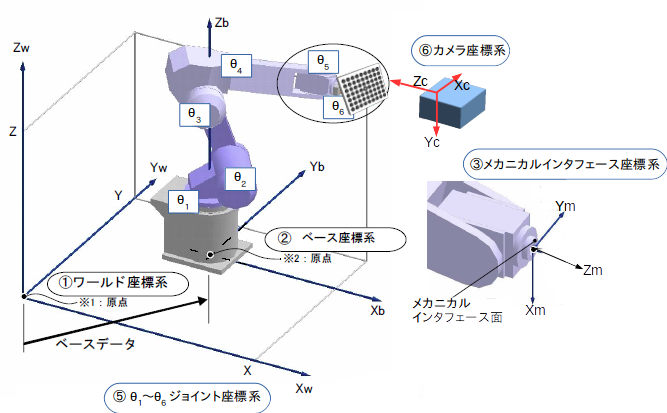

# ロボット(アーム)キャリブレーション

## 概要
1. ロボット(カメラ)キャリブレーションと同様の手順にて、ロボットアームのリンク機構のキャリブレーションを行うパッケージがある http://wiki.ros.org/robot_calibration
2. リンク機構の誤差としては、各リンク毎に6個のパラメータ(位置と姿勢)があるので、計6&times;6=36パラメータ存在する。このうち求解されるのは、各リンク毎の関節角の原点オフセットのみなので計6パラメータである(**関節原点**として試験成績書などに記録があると思います)
3. このパッケージでは関節座標(&theta;1...&theta;6)を入力とするので、それから最終リンク座標(メカニカルインタフェース)を算出するために**URDF**情報が必須
4. その他、キャリブレーションボードが限定されるような(実施経験者を探している)
5. 算出された誤差をロボットに反映させる方法は、ロボットメーカに問い合わせが必要

---

### URDF  
ロボットのリンク機構を記述したテキストファイル。ROSではこの情報が与えられれば、各関節角から各関節の座標を算出する*Tf*パッケージが用意されている、Fanucのロボットは ROS-Industrial
 http://wiki.ros.org/fanuc がサポートしているようであるが、正しいかどうかは不明(Fanucは関知していない)。  

---

### アームの誤差  
ベース座標系基準のメカニカルインタフェース座標系の座標変換を<i>bTm</i>とする。 <i>bTm</i>はロボットコントローラより<i>(x,y,z,w,p,r)</i>などの表記にて得られる位置変数から一意的に求められる。 <i>bTm</i>はロボットコントローラの内部ではROSの*Tf*と同様

---(1)

のような式で関節角から算出している。  
ただし式(1)は誤差を含まない理想モデルのため、現実には様々な誤差がTfに含まれる。主な誤差要因は
1. 関節の原点オフセット
2. リンク機構の製作精度(ジョイント間Tfの誤差)

である。そこで式(1)これらの誤差を含んだ式に書き換えると

---(2)

右辺第1項が誤差要因1、第2項が要因2、による誤差を示す。ロボット(アーム)キャリブレーションの目的は、ロボット(カメラ)キャリブレーションと同様の手順により、最適化計算によって、これらの誤差(&Delta;&theta;,&Delta;f)を推定することである。  
実際には、リンク誤差(&Delta;f)はパラメータ数が多く(最大6個/リンク)、また機構により冗長度が変化することがあり、一般化も困難なためこれを無視し、原点誤差(&Delta;&theta;1..6)の6定数とカメラ座標変換(bTc)の6定数の計12の定数が推定されるようである。

---
---

## (備考)記号定義
- 座標変換行列:は、基準座標系をAとしたときの、座標系Bの変換行列
- 座標変換行列Tは4&times;4の正方行列

- 3&times;3の部分行列Rは回転行列
- 3&times;1の部分行列Sは座標原点の平行移動

- 例題(1) 座標系Bにおける点Pの座標<i>BP</i>を座標系Aでの座標に変換する

- 例題(2) 座標系Bにおける剛体MのPose(座標+姿勢)<i>BM</i>を座標系Aに変換する

