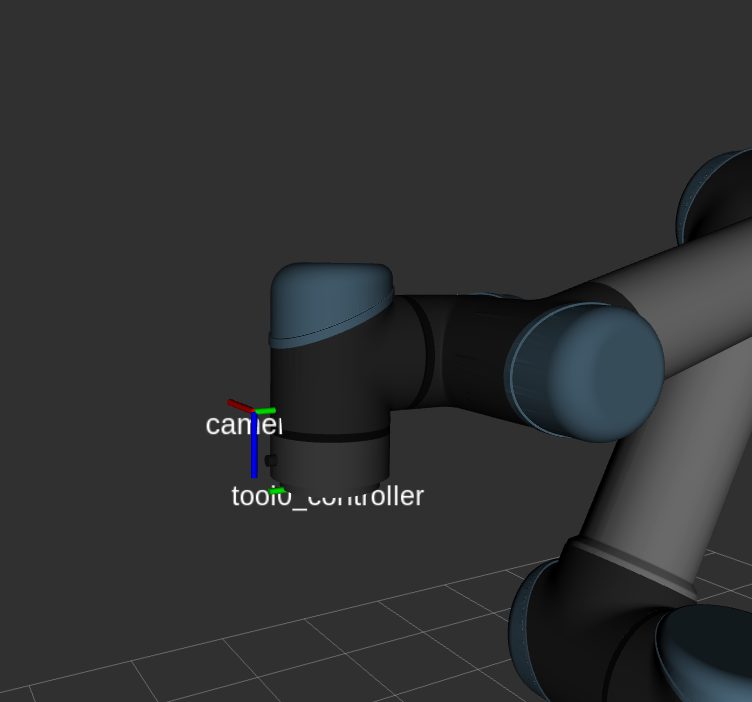
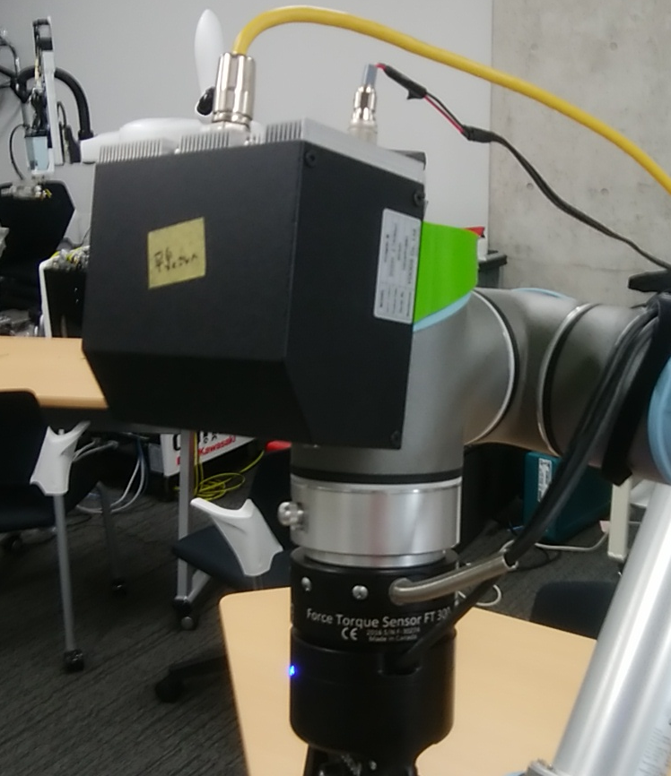

# ロボットキャリブレーション

## 1. ロボットキャリブレーションユーティリティの起動  
**キャリブレーション**を起動する前に、必ず**VTを停止**してください。VTの停止、キャリブレーションの起動とも、ダッシュボードから行います。

## 2. ボードの認識  
1. キャリブレーションボードを床などに置く
2. ボードとカメラの距離が標準WDとなるよう、ジョグ動作にてZ座標を決める
3. ビューワ中心付近にボードが映るように、ジョグ動作にてXY座標を決める
4. ボードが認識されると以下のような表示となる

| |チェックポイント|備考|
|:----|:----|:----|
|□|ボードのZ座標(表示値)が実際のボードーカメラ間距離に一致しているか| |
|□|再投影誤差が0.2以下であるか| |

#### !!トラブルシュート!!
- 照度が40lx以下ではボード認識が出来ません。この場合はストロボ機能を使うか、外部照明を設置します。

## 3. ロボット姿勢の確認

| |チェックポイント|備考|
|:----|:----|:----|
|□|現物とモデルのロボットを姿勢に一致しているか|3Dモデル有効の場合|
|□|ロボットからキャプチャコマンドを送信した後、tool0_controllerフレームが現物のロボットに一致していいるか|3Dモデル無効の場合|
### !!トラブルシュート!!
- Euler座標回転順の不整合(機種ごとの回転順は下表）  

|メーカ|回転順|回転基準|
|:---|:---|:---|
|Melfa|ZYX|Intrinsic|
|Fanuc|XYZ|Extrinsic|
|Motoman|ZYX|Intrinsic|
|Kawasaki|ZYZ|Intrinsic|
|Kuka|ZYX|Intrinsic|
|UR|Vec| |

## 4. 教示  
床に置かれたボードを、様々な位置から撮影します。撮影点の教示は以下を留意します。
1. ロボットの姿勢変化はなるべく大きく
2. ボードに対して対称な姿勢を取る
3. 最低でも4以上の異なる姿勢が必要(6軸ロボット)
4. 冗長な姿勢を加える
5. 参考資料  
  - 標準撮影姿勢  
当方では、正対位置を基準とし、この位置からXYZ軸の順に下表に示す角度分の回転させた姿勢を、作業標準にて定めています。  
１番目の姿勢はホーム位置の姿勢と同じです。  
例えば６番目の姿勢は、まずホーム位置に移動して、そこからX軸回りに20度回転、次にY軸20度回転させた姿勢です。

|姿勢#|X軸回転|Y軸回転|Z軸回転|
|:----|:----|:----|:----|
|1|0|0|0|
|2|20|0|0|
|3|-20|0|0|
|4|0|20|0|
|5|0|-20|0|
|6|20|20|0|
|7|-20|20|0|
|8|20|-20|0|
|9|-20|-20|0|
|10|0|0|60|
|11|0|0|120|
|12|0|0|-60|
|13|0|0|-120|

  - 以下に撮影点の自動経路計画パッケージが公開されています。
https://github.com/IFL-CAMP/easy_handeye
  - 多くで引用されているDr.TSAIのペーパ
https://ieeexplore.ieee.org/document/34770

## 5. 解析  
すべての教示点でデータ（ボード姿勢とロボット姿勢）を採取した後、「解析」ボタンを押下げ、ロボットのメカニカルインタフェース座標基準のカメラ座標への座標変換を求めます。  

| |チェックポイント|備考|
|:----|:----|:----|
|□|ビューワ上のカメラフレームとロボットの位置関係が、現物と一致しているか|下図|
|□|解析誤差が、1mm以下か|悪くても1mm台|

 
  
 
2. 保存  
上側のパネルの「保存」ボタンを押して、キャリブレーション結果を保存します。

### 5.ロボットキャリブレーションユーティリティの終了  
起動とは逆に、先に**キャリブレーション**を停止、**VTを再起動**します。

### Appendix. ロボットキャリブレーションの課題
1. 誤差の評価  
最後の解析誤差を小さくするだけであれば、なるべくロボットの姿勢変化を小さくすればよい。この値だけを基準とすると、決して妥当なキャリブレーションが出来ていないので注意が必要。
2. 妥当性確認    
カメラ座標原点の物理的な位置は、外部から観測できない。このため現物のキャリブレーション結果を評価する手段が確立されていない。
