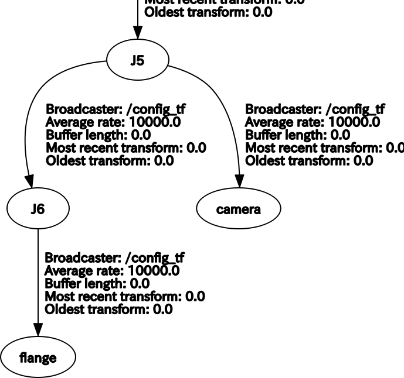
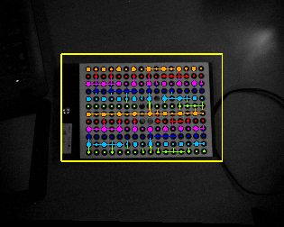
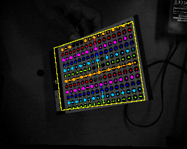

# Robot Calibration

## 準備

1. VISPスタックをインストール
https://visp.inria.fr/

~~~
sudo apt-get install ros-kinetic-visp
sudo apt-get install ros-kinetic-visp-hand2eye-calibration
~~~

2. カメラマウントの定義  
config_tf.yamlを参考にcameraがどこにマウントされているかを記述します。ハンドアイの場合は、ロボットドライバから発行されるTFに合わせて、親フレーム名を編集します。cameraとflangeフレームが必須です。
**注意**  
(1)固定カメラを使うときは"カメラマウントフレームID"(/config_tf/camera/parent_frame_id)をworldにします。ソフトウェアはcameraがworldの直下にある場合を固定カメラと判断しているので、この間に中間的なフレームを介さないようにします。  

3. キャリブ板  
こちらから[A4サイズキャリブ板](gridboard.pdf)-(Y18,X13)-Pitch=15mmを印刷し、平らな板に貼り付けてキャリブ板を作ります[^1]。
[^1]: PDFを印刷して使用する場合、拡大縮小しないで100%で出力してください。
キャリブ板は自分で作ることもできます。以下の条件でイラストレータ等を使って作ってください。

~~~
- 二重丸のサイズは黒丸のサイズと同じ。二重丸の内側の半径は外側の半径の半分とする。
- 二重丸は３つ。中央にひと、X軸方向には中央からひとつ飛ばして、Y軸方向には中央に隣接するように配置する。
- それ以外は黒丸。丸は中央二重丸を基準として、上下左右対称な個数があるのがのぞましい。
- あまり細かすると円の輪郭認識精度が悪くなる。
- ボードは白黒反転しても構いません。
~~~

4. param.yamlの編集  
使用するキャリブ板に合わせて以下のようにparam.yamlを編集します。このファイルもユーティリティ起動後はパネルから変更可能です。ファイルの配置場所はrovi_utils/r-calibです。

~~~
- n_circles_x, n_circles_yをXY方向の●の下図に合わせてください。X方向は二重丸が一つ間が空いてる方向、Y方向は二重丸が隣接している方向です。
- origin_x, origin_yをXYの＋方向から数えた中心位置の数に合わせる。カウントはゼロからとしてください。
- 背景が黒のキャリブ板の場合、gamma_correctionは0.5〜0.7付近、背景が白の場合は1.0に設定してください。
~~~

## 起動

1. [RoVIの起動](https://github.com/YOODS/rovi#%E8%B5%B7%E5%8B%95)

2. ロボットドライバ起動

3. /config_tfパラメータのロード  
準備の２にて作成したyamlファイルをロードします。ファイル名がconfig_tf.yamlすると
~~~
rosparam load config_tf.yaml
~~~

4. ロボットキャリブレーションユーティリティの起動  

~~~  
roslaunch rovi_utils rcalib.launch
~~~

5. 確認  
rvizのTF表示にて確認します。以下のツールでも確認できます。
~~~
rosrun rqt_tf_tree rqt_tf_tree
~~~
などでTF構成を確認します。正しく設定されていれば下図のような構成になります(J5,J6はロボットドライバによって異なります)。  

## 操作  
ロボットキャリブレーションは、この図の"camera"フレームとそのベースフレーム(図中"J5"フレーム)の座標変換を求める、ことです。  
次の手順にて行います。

1. 撮影調整  
床などに置いたキャリブ板を様々な視点から撮影することで、キャリブレーションのデータを収集します。キャリブ板を認識すると、下図のようにハイライトされます。  
この状態が保たれるよう、*R-Calibパネル*の"ライブ調整”や照明を調整します。  

2. 視点移動  
黄色枠にキャリブ板が合うようにロボット姿勢を動かします。
またこのとき*R-Calibパネル*の"再投影誤差"が*0.2*以下であることを確認します。  

3. 取り込み  
最初はR-Calibパネルの"カウント”が０であることを確認します。０でなければ「カウントリセット」を押して０にします。  
「取り込み」ボタンを押すことで、データ(ロボット座標とキャリブ板座標)が取り込まれ、黄色枠は次のロボット姿勢の指示に変わります。2&rarr;3を20箇所程度繰り返します。
4. 解析  
取り込んだデータを解析します。結果の妥当性は、R-Calibパネルの"結果”&rarr;
"誤差"にて判断します。誤差が1mm(0.001m)以下であれば妥当です。  
やり直す場合は、「カウントリセット」して収集したデータを破棄してから
5. 保存  
解析結果のTransformは*ConfigTFパネル*の"カメラ/カメラマウント変換"に表示されています。誤差が妥当であれば「保存」ボタンを押してconfig_tf.yamlに書き込みます。
6. 利用  
このキャリブレーション結果をそれぞれのパッケージ内のファイルに反映させるには、後述の起動オプションにてファイルを指定します。

## Appendix
### 起動オプション

|タグ|デフォルト値|説明|
|:----|:----|:----|
|result|r-calib/rcalib.yaml|キャリブレーション結果Transformを書き出すyamlファイル名を与える|

### Topics
1. To subscribe

|name|type|description|
|:----|:----|:----|
|/rovi/left/image_rect|Image|基準カメラ(左)のレクティファイ画像|
|/request/clear|Bool|取得したデータをクリアする。|
|/request/capture|Bool|ロボットとキャリブ板の座標をTFから得て、バッファにストアする。|
|/request/solve|Bool|ストアされたデータから、カメラマウントからカメラへの座標変換を算出し、パラメータに書き込む|

2. To publish

|name|type|description|
|:----|:----|:----|
|/gridboard/image_out|Image|キャリブ板の認識結果|
|/response/cleare|Bool|clear処理完了でアサートされます|
|/response/capture|Bool|capture処理完了でアサートされます|
|/response/solve|Bool|solve処理完了でアサートされます|
