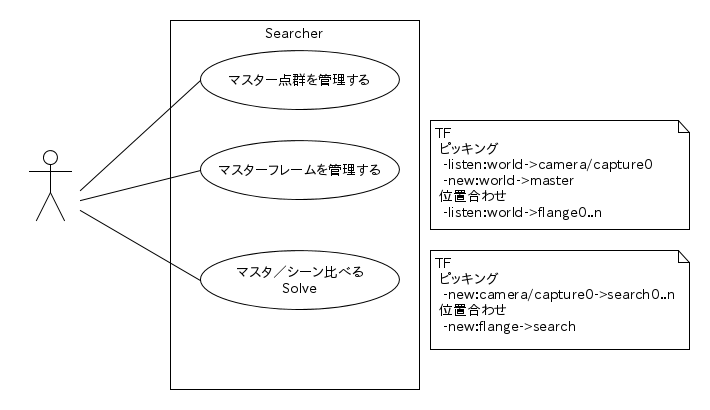

## Searcher

### 要件
- 入力(モデルおよびシーン)点群を解析し、モデルとシーン間の座標変換を求める
- 求めた座標変換をTFに送る
- 解析には様々なアルゴリズム(Open3D,Halcon)が使えるように、アルゴリズム部を外部モジュール化する

### UML

## 準備
### Open3D
~~~
pip install open3d-python --user
~~~
OPen3D-0.6からPipのバージョンが9.0.1以上が必要となりました。これより古いときは
~~~
pip install pip==9.0.3
~~~

## Parameter
### ~Config

|name|type|description|
|:----|:----|:----|
|register_frame_id|string[]|登録時にファイル保存するフレーム名。別名のマスターフレーム(*master0..n*)が生成される|
|place_frame_id|string|解析結果フレーム(*solve0..n*)を配置するフレーム名|

### ~  
ローカルパラメータ領域にSolverパラメータを配します。

## Topics
### To subscribe

|Topic|タイプ|説明|
|:----|:----|:----|
|~in/*/floats|Floats|シーン点群。*はlines argumentで与えた点群の系列名|
|~clear|Bool||
|~solve|Bool||
|~load|Bool||
|~save|Bool||

### To publish

|Topic|タイプ|説明|
|:----|:----|:----|
|~master/*/floats|Floats|モデル点群。モデルをロードしたとき、およびシーンをsubscribeしたとき初期位置の点群をpublishする|

----
## Solver標準化  
SearcherはSolverを外部モジュール化し、様々なアルゴリズムのSolverを組み込むように設計されています。Searcherに組み込み可能なSolverは以下の設計標準に適合していなければなりません。
### インタフェース  
Solverモジュールは以下のメソッド(モジュール内では関数)が必須です。
1. learn(master_data:list of Numpy array,param:dictionary)
2. result:dictionary = solve(scene_data:list of Numpy array,param:dictionary)  
 - resultには"transform"キーと、その値としてTransformの配列が必須です
 - resultには"transform"以外の任意のキーを含むことが出来ます。これはマッチングのスコアとしてscoreトピックにpublishされます。データ形式はfloatの配列に限ります。

### テスト  
ソルバーのテストは、ローカルのテストデータなどを使って、単体テストが実行できるように実装しなければなりません。本Respositryの*o3d_solver.py*を参考にしてください。
~~~
./o3d_solver.py
~~~
