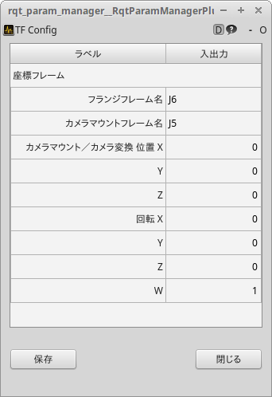

# TF-Config

## カメラの設置手順  
カメラがどこに設置されているか、また設置されている座標(ロボットキャリブレーション結果)をTFへ送るユーティリティがtf_configです。  
### 起動
~~~
roslaunch rovi_utils tf_config.launch
~~~
以下のパネルより装置の構成を設定します。

|ラベル|説明|パラメータ名|
|:----|:----|:----|
|フランジフレーム名|ロボットのメカニカルインタフェースのフレーム名|/tf_config/alias/flange|  
|カメラマウントフレーム名|カメラが取り付けられているフレーム名。固定カメラであれば"world"となります|/tf_config/alias/mount|
|カメラマウント/カメラ変換|いわゆるロボットキャリブレーションの値|/tf_config/alias/mount|

「保存」を押すとtf_config.yamlファイルに書き込まれます。内容を変更した場合は再起動が必要です。  
この設定にてtf_configを起動したときのTF_TREEは下図のようになります。
 
次のロボットキャリブレーションを含め、**ロボットとRoVIを連携する場合は、必ず先にtf_configを起動しておきます**
